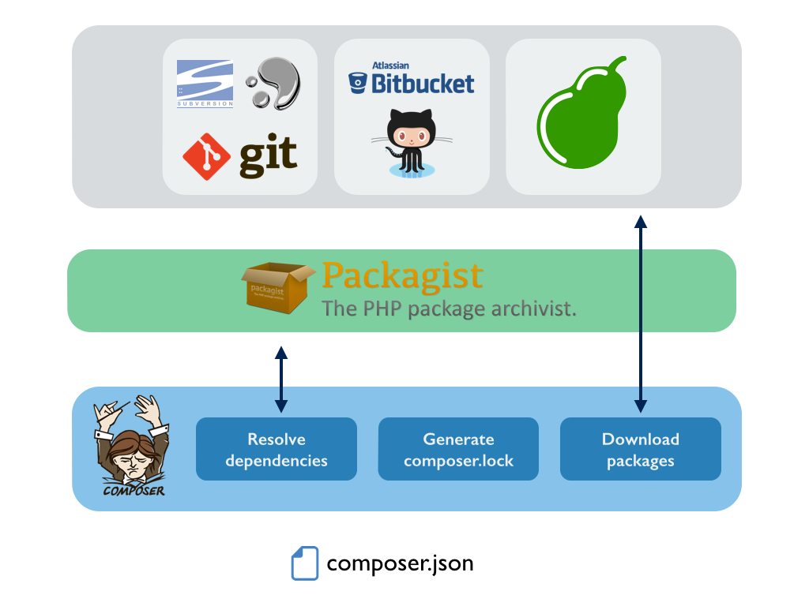
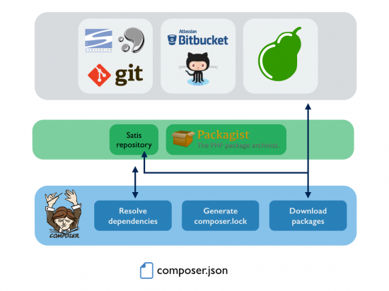

I use the Symfony stack at work, and we have a code architecture with a lot of common components (model, dao, provider) for each object (profile, job, company, etc...). I think we have about 20-30 common private repositories shared by a few websites and apps.

We had a growing problem: every time we were pushing something on GIT, the CI would take around five minutes to deploy a new version. 

I looked up on internet to find a solution, and I came upon deploying a private composer server by using Satis. Our CI deployments went from five minutes to 30-45s by creating archives. We also reduced the time to generate a composer.lock and we added a bit of redundancy when composer or packagist/github/bitbucket are down (happens more than you think!)

## How ?

Unless we explicitly indicate that we want to use a different repository, Composer makes use of the default repository: Packagist. Composer will ask Packagist for information about all packages required in the composer.json file, as well as dependencies required by those packages. When Composer gets all that information, it solves the dependency graph using a SAT solver and generates the composer.lock file with the specific packages that must be installed in order to fulfil the requirements defined in the composer.json file. Finally, Composer downloads those packages from different sources: GitHub, Bitbucket, PEAR or any GIT/SVN/Mercurial repository.
 

By adding a custom repository, Composer asks only packagist if our repository does not have the information. In addition, composer can download the packages directly from Satis.

## Installation

The installation is really simple if you can use Docker :) 

You can check the docs here for the installation : https://github.com/composer/satis

Next you will have to configure your repositories in the main file satis.json

<pre>
<code>
{
  "name": "My Repository",
  "homepage": "http://packages.example.org",
  "repositories": [
    { "type": "vcs", "url": "https://github.com/mycompany/privaterepo" },
    { "type": "vcs", "url": "http://svn.example.org/private/repo" },
    { "type": "vcs", "url": "https://github.com/mycompany/privaterepo2" }
  ],
  "require-all": true,
  "archive": {
    "directory": "dist",
    "format": "tar",
    "skip-dev": true
  },
  "require-dependencies": true,
  "require-dev-dependencies": true
}
</code>
</pre>
 
By using `composer install --prefer-dist` on your CI, composer will now download archives instead of git repositories.
 
In addition, by adding the option `require-dependencies: true` in Satis.json, Composer will also resolve the dependencies tree by using Satis. In our case, composer tree resolvation (happens when you do a composer update) went from 1min30 to 10s
